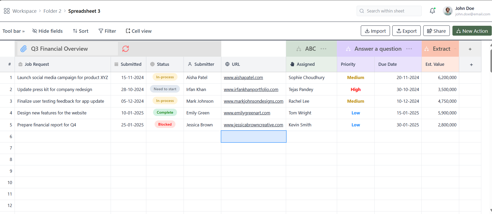

# 📊 Spreadsheet App

A modern, interactive spreadsheet web app inspired by Excel — built with **React**, **TypeScript**, and **Tailwind CSS**.

This app provides a smooth, spreadsheet-like user experience with editable cells, resizable columns, dynamic column addition, and automatic data persistence using local storage.

---

## 🚀 Features

* ✅ **Inline Editable Cells** – Edit any cell by simply clicking on it
* 📏 **Resizable Columns** – Adjust widths with intuitive drag-and-drop
* ➕ **Dynamic Column Addition** – Add new columns on the fly
* 💾 **LocalStorage Persistence** – Your data and column widths are saved locally
* 🧰 **Toolbar** – Tools for sorting, filtering, importing, exporting, and more
* 📁 **Section Tabs** – Navigate through views like *All Orders*, *Pending*, *Reviewed*, etc.
* 📐 **Powered by @tanstack/react-table v8** – Customizable, headless table rendering

---

## 🛠️ Tech Stack

* ⚛️ **React 18**
* 🧠 **TypeScript**
* 💅 **Tailwind CSS**
* 🧩 **@tanstack/react-table v8**
* 🎨 **React Icons** (`lucide-react`, `react-icons`)

---

## 📸 Preview

**Live Demo:** [spreadsheet10.netlify.app](https://spreadsheet10.netlify.app/)



---

## 📂 Installation & Setup

```bash
git clone https://github.com/Vikram-Kumar-Sahu/SpreadSheet.git
cd SpreadSheet
npm install
npm run dev          # Start development server
npm run lint         # Run ESLint + Prettier
npm run type-check   # Run TypeScript type checking
```

---


